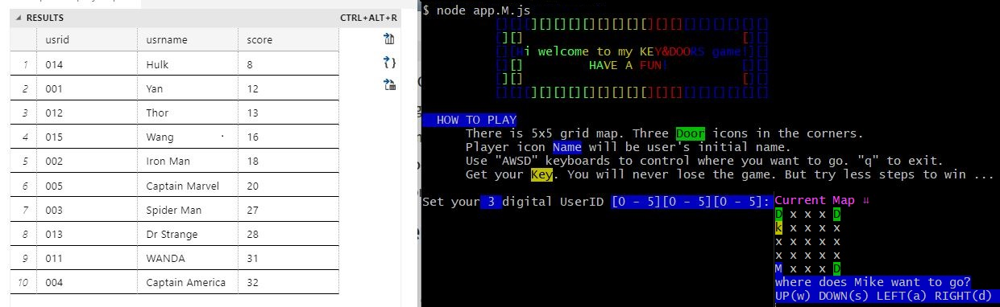

# Game App Development -InceptionU project1 

# (Oct 26 2022)

### Game Name

Key and doors 🔑🔒🔒🔒

### Introduction of my game

- There is 5x5 grid map. Three "Door" icons in the corners.

- Player icon will be user's initial name.

- Use "AWSD" keyboards to control where you want to go. "q" to exit.

- Get your "Key" You will never lose the game. But try less steps to win ...

### Technologies I used for this game

1. Node.js
2. Express.js
3. Java script
4. MS SQL server
5. MongoDB
6. Postman
7. VS code
8. Typora

### The dependencies I used for this game

**Frontend**: “Chalk” “chalk-animation” “dotenv” “node-fetch” “readline-sync”

**Backend**:“express”“mssql” “mongoose” “body-parser” “cors” “dotenv”

### How to play

1. Run `npm install` in the directory

2. In terminal, run`nodemon server.M.js`, turn on server in backend

3. In another terminal, run`node add.M.js`, turn on app in frontend.
4. MS SQL will save player information and send the winner list back to frontend in the game end.

5. You start to play. Good luck! 🎃

